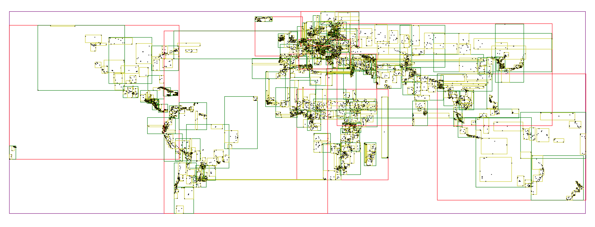

# rtree.h

An [R-tree](https://en.wikipedia.org/wiki/R-tree) generator for C.
It's small & fast and includes a variety of options for creating
in-memory rtree collections.



_This is a companion to [btree.h](https://github.com/tidwall/btree.h)._

## Features

- Compile-time generation using preprocessor templates
- Type-safe generic data structure
- Single-file header with no dependencies
- Namespaces
- Support for custom allocators.
- Copy-on-write with O(1) cloning.
- Supports most C compilers (C99+). Clang, gcc, tcc, etc
- Webassembly support with Emscripten (emcc)
- Exhaustively tested with 100% coverage
- Very fast 🚀

## Goals

- Give C programs high performance in-memory rtrees
- Provide a template system for optimized code generation
- Allow for sane customizations and options

## Example

```c
#include <stdio.h>
#include <string.h>
#include <math.h>


struct city {
    char *name;
    double lat;
    double lon;
};

void city_rect(struct city city, double min[2], double max[2]) {
    min[0] = max[0] = city.lon;
    min[1] = max[1] = city.lat;
}

#define RTREE_NAME cities
#define RTREE_TYPE struct city
#define RTREE_ITEMRECT city_rect(item, min, max);
#include "rtree.h"

struct city phx = { .name = "Phoenix", .lat = 33.448, .lon = -112.073 };
struct city enn = { .name = "Ennis", .lat = 52.843, .lon = -8.986 };
struct city pra = { .name = "Prague", .lat = 50.088, .lon = 14.420 };
struct city tai = { .name = "Taipei", .lat = 25.033, .lon = 121.565 };
struct city her = { .name = "Hermosillo", .lat = 29.102, .lon = -110.977 };
struct city him = { .name = "Himeji", .lat = 34.816, .lon = 134.700 };

bool city_iter(struct city city, void *udata) {
    printf("%s\n", city.name);
    return true;
}

int main() {
    // Create a new rtree variable
    struct cities *tr = 0;

    // Load some cities into the rtree.
    cities_insert(&tr, phx, 0);
    cities_insert(&tr, enn, 0);
    cities_insert(&tr, pra, 0);
    cities_insert(&tr, tai, 0);
    cities_insert(&tr, her, 0);
    cities_insert(&tr, him, 0);
    
    // Search for cities
    printf("\n-- Northwestern cities --\n");
    cities_search(&tr, (double[2]){-180, 0}, (double[2]){0, 90}, city_iter, 0);

    printf("\n-- Northeastern cities --\n");
    cities_search(&tr, (double[2]){0, 0}, (double[2]){180, 90}, city_iter, 0);

    // Deleting an item is similar inserting, except that the second arg is a
    // key and the third is a pointer to the deleted data.
    printf("\n-- Delete Phoenix --\n");
    struct city old;
    cities_delete(&tr, phx, &old, 0);
    printf("%s deleted\n", old.name);

    printf("\n-- Northwestern cities --\n");
    cities_search(&tr, (double[2]){-180, 0}, (double[2]){0, 90}, city_iter, 0);

    cities_clear(&tr, 0);
}
// output:
// -- Northwestern cities --
// Phoenix
// Hermosillo
// Ennis
// 
// -- Northeastern cities --
// Prague
// Taipei
// Himeji
// 
// -- Northwestern cities --
// Ennis
// Hermosillo
```

## Options

rtree.h provides a bunch of options for customizing your rtree. All options are set using the C preprocessor.

| Option                        | Description |
| :---------------------------- | :---------- |
| RTREE_NAME `<name>`           | The Namespace |
| RTREE_TYPE `<type>`           | The rtree item type |
| RTREE_ITEMRECT `<code>`       | Generate a rectangle for an item |
| RTREE_FANOUT `<int>`          | Set the fanout (max number of children per node) |
| RTREE_COMPARE `<code>`        | Define a "compare" comparator. Used for deletions |
| RTREE_MALLOC `<code>`         | Define custom malloc function |
| RTREE_FREE `<code>`           | Define custom free function |
| RTREE_COW                     | Enable copy-on-write support |
| RTREE_NOATOMICS               | Disable atomics for copy-on-write (single threaded only) |
| RTREE_ITEMCOPY `<code>`       | Define operation for internally copying item |
| RTREE_ITEMFREE `<code>`       | Define operation for internally freeing items |
| RTREE_FLOAT32                 | Use 32-bit float internally |
| RTREE_FLOAT16                 | Use 32-bit float internally (arm64 only) |
| RTREE_HEADER                  | Generate header declaration only. |
| RTREE_SOURCE                  | Generate source declaration only. |

## Namespaces

Each rtree.h rtree will have its own namespace using the `RTREE_NAME` define.

For example, the following will create an rtree using the `cities` namespace.

```c
#define RTREE_NAME cities
#define RTREE_TYPE struct city
#define RTREE_ITEMRECT city_rect(item, min, max);
#include "rtree.h"
```

This will generate all the functions and types using the `cities` prefix, such as:

```c
struct cities; // The cities type
int cities_search(struct cities **root, struct city key, void *udata);
int cities_insert(struct cities **root, struct city item, void *udata);
int cities_delete(struct cities **root, struct city key, void *udata);
```

It's also possible to generate multiple rtrees in the same source file.

```c
#define RTREE_NAME airports
#define RTREE_TYPE struct airport
#define RTREE_ITEMRECT airport_rect(item, min, max);
#include "rtree.h"

#define RTREE_NAME fleet
#define RTREE_TYPE struct vehicle
#define RTREE_ITEMRECT vehicle_rect(item, min, max);
#include "rtree.h"

#define RTREE_NAME customers
#define RTREE_TYPE struct customer
#define RTREE_ITEMRECT customer_rect(item, min, max);
#include "rtree.h"
```

## API

All operations use the same namespace as the provided `RTREE_NAME`.

So if you created an rtree named `fleet` using

```c
#define RTREE_NAME fleet
```

then the following functions will be available.

```c

fleet_insert(tree, item, udata);
fleet_delete(tree, item, old, udata);
fleet_scan(tree, iter_callback, udata);
fleet_search(tree, min, max, iter_callback, udata);
fleet_clear(tree, udata);
fleet_clone(tree, tree_copy, udata);   // O(1) copy-on-write
fleet_copy(tree, tree_copy, udata);
fleet_count(tree)
fleet_rect(tree, min_out, max_out);
```

## Return codes

Most operations return a value.
Here's a list of possible values.
These too share the same namespace.

```c
fleet_INSERTED    // New item was inserted
fleet_DELETED     // Item was successfully deleted
fleet_NOTFOUND    // Item was not found
fleet_FINISHED    // Callback iterator returned all items
fleet_STOPPED     // Callback iterator was stopped early
fleet_COPIED      // Tree was copied: `clone`, `copy`
fleet_NOMEM       // Out of memory
fleet_UNSUPPORTED // Operation not supported
```

## Performance

- Linux, AMD Ryzen 9 5950X 16-Core processor
- CC=clang-17 CFLAGS=-ljemalloc
- Items are simple 16-byte points (x,y). 

Benchmarking 1000000 items, 5 times, taking the average result

```
tidwall/rtree.h
Benchmarking 1000000 items, 5 times, taking the average result
insert(rand)        1,000,000 ops in   0.150 secs    150.0 ns/op     6,666,032 op/sec
search(rand)        1,000,000 ops in   0.200 secs    200.0 ns/op     5,000,086 op/sec
delete(rand)        1,000,000 ops in   0.248 secs    247.8 ns/op     4,035,493 op/sec
insert(hilbert)     1,000,000 ops in   0.094 secs     93.7 ns/op    10,667,015 op/sec
search(hilbert)     1,000,000 ops in   0.073 secs     72.9 ns/op    13,721,019 op/sec
delete(hilbert)     1,000,000 ops in   0.074 secs     74.3 ns/op    13,453,151 op/sec
```

## Algorithm

This implementation is a variant of the original paper:  
[R-TREES. A DYNAMIC INDEX STRUCTURE FOR SPATIAL SEARCHING](https://www.cs.princeton.edu/courses/archive/fall08/cos597B/papers/rtrees.pdf)

### Inserting

Similar to the original paper. From the root to the leaf, the rects which will incur the least enlargment are chosen. Ties go to rects with the smallest area. 

Added to this implementation: when a rect does not incur any enlargement at all, it's chosen immediately and without further checks on other rects in the same node. 

### Deleting

A target rect is searched for from root to the leaf, and if found it's deleted. When there are no more child rects in a node, that node is immedately removed from the tree.

### Searching

Same as the original algorithm.

### Splitting

This is a custom algorithm. It attempts to minimize intensive operations such as pre-sorting the children and comparing overlaps & area sizes. The desire is to do simple single axis distance calculations each child only once, with a target 50/50 chance that the child might be moved in-memory.

When a rect has reached it's max number of entries it's largest axis is calculated and the rect is split into two smaller rects, named `left` and `right`.
Each child rects is then evaluated to determine which smaller rect it should be placed into.
Two values, `min-dist` and `max-dist`, are calcuated for each child. 

- `min-dist` is the distance from the parent's minumum value of it's largest axis to the child's minumum value of the parent largest axis.
- `max-dist` is the distance from the parent's maximum value of it's largest axis to the child's maximum value of the parent largest axis.

When the `min-dist` is less than `max-dist` then the child is placed into the `left` rect. 
When the `max-dist` is less than `min-dist` then the child is placed into the `right` rect. 

## Contributing

Please please please do not open a PR without talking to me first.
At the very least open an issue describing the problem in detail.
